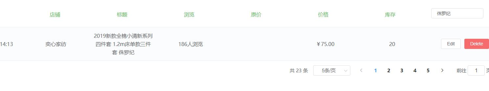

### 项目分工说明
### 项目名称：八只小猪
``````````
项目未能上线阿里云服务器到期
首页，详情页，列表页，登录注册，用户信息
移动端页面github地址：https://github.com/gzh51906/Eight-Piglets
官网：https://www.8pig.com  
``````````
### 团队成员
`````
组长：张俊 组员：汤于 姚美利
``````
### 负责模块

``` 
每人负责相应页面及其功能
汤于：首页 目的地 咨询  关于我们
姚美利 ： 登录 注册 发现页 我的页面
张俊 ：后台管理系统
````

### 项目页面截图




   


